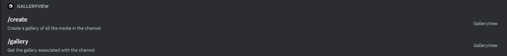
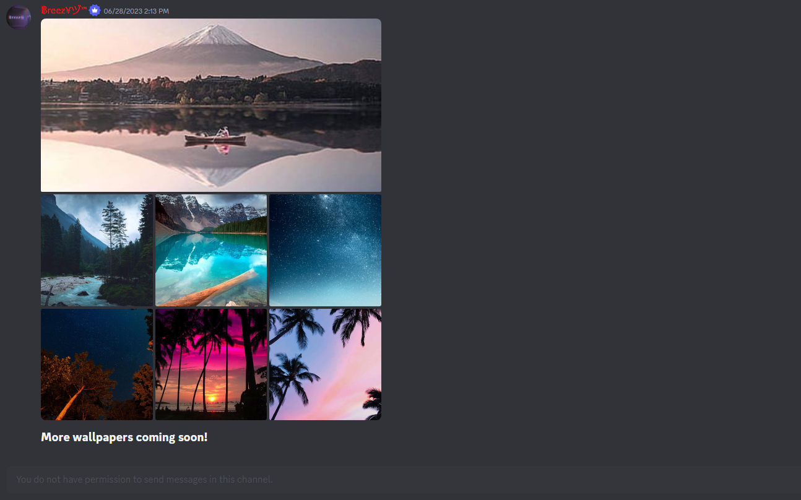
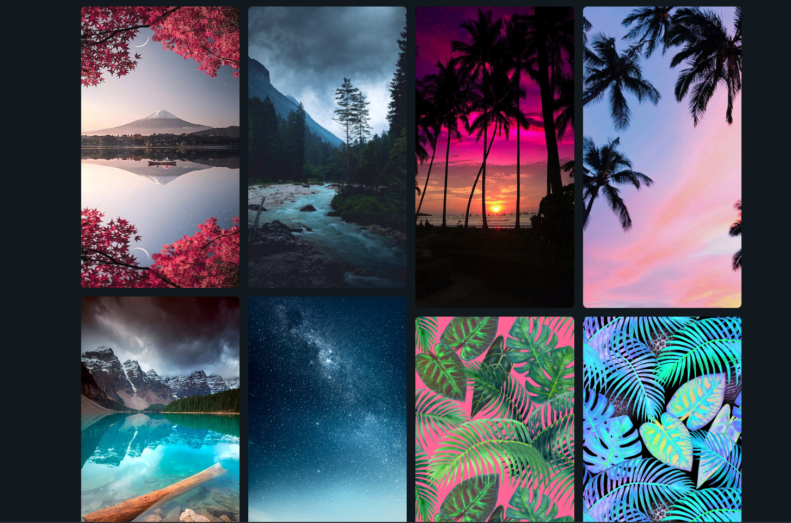
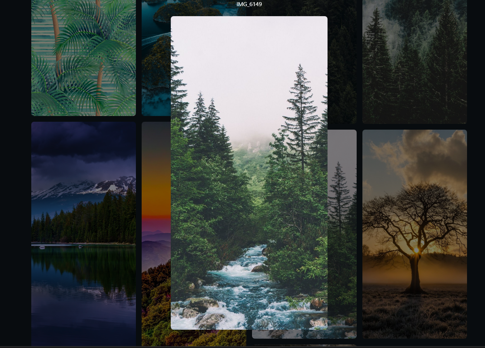

# Discord GalleryView (1.0)

Discord Bot and tool for creating a "gallery view" with the media in a specified discord channel.

## Quick Start

The easiest way to get started with [GalleryView](https://discordgalleryview.ezsnova.repl.co/) is to use the discord bot.
You can **invite the bot to your server** [here](https://discord.com/api/oauth2/authorize?client_id=1136039549894676490&permissions=124928&scope=bot)

Once the bot is in your server, you can use slash commands to either create or get a gallery view.

## Showcase

Image you are on a great wallpaper server as [✨ • Wallpaper World • ✨](https://discord.gg/wallpaper) and you want to view all the wallpapers in a channel a bit more nicely.

You could use [GalleryView](https://discordgalleryview.ezsnova.repl.co/) to get a nice view like this:

And have some extra functionality as:

You can check the gallery used for the example [here](https://discord.com/channels/@me/1037385503747608646/1136351944315768872)

## Get GalleryView

1. [Discord bot](https://discord.com/api/oauth2/authorize?client_id=1136039549894676490&permissions=124928&scope=bot)
2. [Web app](https://discordgalleryview.ezsnova.repl.co/)
